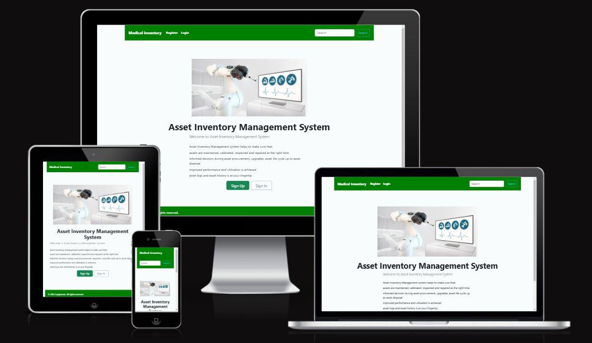

<h1 align="start">Asset Inventory Management System</h1>

[View the live project here](https://asset-inventory-ff6bf56d6fc8.herokuapp.com/)

The Asset Inventory Management System is a web-based database for medical 
equipment. The database can be tailored to be used by non-technical staff and 
technical staff working in the hospitals.

The Asset Inventory Management System helps to make sure that:
*	assets are maintained, calibrated, inspected and repaired at the right time
*	informed decision during asset procurement, upgrades, asset life cycle up to asset disposal
*	improved performance and utilization are achieved
*	asset logs and asset history are at your fingertip

This platform required strict control over which users could access and add equipment, update equipment repairs, maintenance and event logs in the system. Only the administrator and the users the administrator gave permission can delete the event logs since this detail maybe required in a court of law in the event of fatal incident due to malfunction of the equipment which results in injury or death of patient.

The Sign-Up process requires
* Only verified and approved individuals should be able to access the platform and add, view, update and delete equipment history.
* The approval process should involve manual review and authorization by an admin user.
* User details, including Health Facility name, must be entered and validated during registration.
* The users can only view their Health Facility Equipment list and in position to add and update their equipment only.

## Index – Table of Contents
* [User Experience (UX)](#user-experience-ux) 
* [Features](#features)
* [Design](#design)
* [Planning](#planning)
* [Technologies Used](#technologies-used)
* [Testing](#testing)
* [Deployment](#deployment)
* [Credits](#credits)

## User Experience (UX)

### User stories :

* US01: Illustrate purpose of application through UI
  - As a **Site User** I can **view the landing page** so that **I can determine the purpose of the application**
* US02: Navigate site
  - As a **Site User** I can **easily register** so that **I can easily access application functionality**
* US03: View equipment list
  - As a **Site User** I can **view a list of my facility equipment** so that **I can select one to access more details by clicking the highlited name**
* US04: View equipment information
  - As a **Site User** I can **click on equipment or scheduled or unscheduled work order** so that **I can view  full details of equipment**
* US05: Add new equipment
  - As a **Site User** I can **add new equipment by clicking add equipment button** so that **I can build my facility equipment database**
* US06: View equipment in Inventory 
  - As a **Site User** I can **access a list of my facility equipment** so that **I can make decision on what action to take on each piece of equipment**
* US07: Delete equipment
  - As a **Site User** I can **delete equipment** so that **it is no longer on the facility list**
* US08: Search equipment
  - As a **Site User** I can **easily search equipment using asset tag number** so that **I can quickly find what I am looking for**
* US09: Update equipment
  - As a **Site User** I can **update my facility equipment only** so that **I have the latest history on each piece of equipment**
* US10: Create scheduled work order
  - As a **Site User** I can **create a calibration or preventative maintainance event equipment** so that **I make sure equipment is safe to use on patients all the time**
* US11: Create unscheduled work order
  - As a **Site User** I can **create repair orders to the equipment** so that **I take control is the repairing of equipment**
* US12: Equipment status
  - As a **Site User** I can ** assign equipment as in use, under repair or decommissioned** so that **I can report to facility management the status of the equipment**
* US13: Account registration and login
  - As a **Site User** I can **register an account** so that **I can log in and then add equipment, view equipment, update equipment, delete equipment, search equipment and export equipment as pdf**
* US14: Manage 
  - As a **Site Admin** I can **approve who create, read, update and delete equipment on a facility** so that **I can manage site content and security of the data**
* US15: Manage Facilities and Departments
  - As a **Site Admin** I can **Add Facilities and Departments** so that **I can manage who views or add equipment to the facilities and departments**
* US16 Approve Users
  - As a **Site Admin** I can **review and then approve or disapprove a User** so that **the right Users always have access to the facility equipment database**
* US17 Assign Manufacturers and Catagories
  - As a **Site Admin** I can **assign equipment manufacturers and equipment catagories** so that **I can follow international nomenclature for all facilities**

## Features

### Existing Features
