<h1 align="start">Asset Inventory Management System</h1>

[View the live project here](https://asset-inventory-ff6bf56d6fc8.herokuapp.com/)

The Asset Inventory Management System is a web-based database for medical 
equipment. The database can be tailored to be used by non-technical staff and 
technical staff working in the hospitals.

The Asset Inventory Management System helps to make sure that:
*	assets are maintained, calibrated, inspected and repaired at the right time
*	informed decision during asset procurement, upgrades, asset life cycle up to asset disposal
*	improved performance and utilization are achieved
*	asset logs and asset history are at your fingertip

This platform required strict control over which users could access and add equipment, update equipment repairs, maintenance and event logs in the system. Only the administrator and the users the administrator gave permission can delete the event logs since this detail maybe required in a court of law in the event of fatal incident due to malfunction of the equipment which results in injury or death of patient.

The Sign-Up process requires
* Only verified and approved individuals should be able to access the platform and add, view, update and delete equipment history.
* The approval process should involve manual review and authorization by an admin user.
* User details, including Health Facility name, must be entered and validated during registration.
* The users can only view their Health Facility Equipment list and in position to add and update their equipment only.

**Relationship Diagrams For DBMS**

The Relationship diagram for the DBMS consists of the following tables: Manufacturer, Category, Health Facility, Service Provider, Department, Equipment Location, Equipment and CustomUser

## Index – Table of Contents
* [User Experience (UX)](#user-experience-ux) 
* [Features](#features)
* [Design](#design)
* [Planning](#planning)
* [Technologies Used](#technologies-used)
* [Testing](#testing)
* [Deployment](#deployment)
* [Credits](#credits)

## User Experience (UX)

### User stories :

* US01: Illustrate purpose of application through UI
  - As a **Site User** I can **view the landing page** so that **I can determine the purpose of the application**
* US02: Navigate site
  - As a **Site User** I can **easily register** so that **I can easily access application functionality**
* US03: View equipment list
  - As a **Site User** I can **view a list of my facility equipment** so that **I can select an equipment to access more details by clicking the highlighted name of the equipment on the equipment list**
* US04: View equipment information
  - As a **Site User** I can **click on equipment or scheduled or unscheduled work order** so that **I can view  full details of equipment**
* US05: Add new equipment
  - As a **Site User** I can **add new equipment by clicking add equipment button** so that **I can build my facility equipment database**
* US06: View equipment in Inventory 
  - As a **Site User** I can **access a list of my facility equipment** so that **I can make decision on what action to take on each piece of equipment**
* US07: Delete equipment
  - As a **Site User** I can **delete equipment** so that **it is no longer on the facility list**
* US08: Search equipment
  - As a **Site User** I can **easily search equipment using asset tag number** so that **I can quickly find what I am looking for**
* US09: Update equipment
  - As a **Site User** I can **update my facility equipment only** so that **I have the latest history on each piece of equipment**
* US10: Create scheduled work order
  - As a **Site User** I can **create a calibration or preventative maintainance event equipment** so that **I make sure equipment is safe to use on patients all the time**
* US11: Create unscheduled work order
  - As a **Site User** I can **create repair orders to the equipment** so that **I take control is the repairing of equipment**
* US12: Equipment status
  - As a **Site User** I can **assign equipment as in use, under repair or decommissioned** so that **I can report to facility management the status of the equipment**
* US13: Account registration and login
  - As a **Site User** I can **register an account** so that **I can log in and then add equipment, view equipment, update equipment, delete equipment, search equipment and export equipment as pdf**
* US14: Manage 
  - As a **Site Admin** I can **approve who create, read, update and delete equipment on a facility** so that **I can manage site content and security of the data**
* US15: Manage Facilities and Departments
  - As a **Site Admin** I can **Add Facilities and Departments** so that **I can manage who views or add equipment to the facilities and departments**
* US16 Approve Users
  - As a **Site Admin** I can **review and then approve or disapprove a User** so that **the right Users always have access to the facility equipment database**
* US17 Assign Manufacturers and Categories
  - As a **Site Admin** I can **assign equipment manufacturers and equipment catagories** so that **I can follow international nomenclature for all facilities**

## Features

### Existing Features

-  **F01 Navigation Bar**

      This platform required strict control over which users could access and add equipment, update equipment repairs, maintenance and event logs in the system. The user must register or sign in before access is granted to the site.   If the user signed in is the admin user then an additional link of Admin is also shown on the navigation bar.  This link takes the user to the Django Admin screens where data in the underlying database can be added, retrieved, modified and deleted. The navigation bar is responsive on multiple screen sizes - on smaller screens it coverts to a 'burger' menu style. 

      Register/Login Navbar

      

      Navbar Full Signed in as User

      

      Navbar Full Signed in as Admin

      

      Navbar Burger Menu

      

-  **F02 Landing page image**

      The landing page shows the register or login Navbar and at the bottom of the page there is a sigh up or sign in button. The text inbetween describe the importance and advantages of using Asset Inventory Management System database in facilities and Hospitals.

      

-  **F03 Home page image**

      Once the user is signed in the user lands on a home page. The user is now able to view the equipment using view equipment button at the bottom of the page or using equipment button on the Navbar

      

-  **F04 Equipment List image**

      After clicking **view equipment or equipment button** the user is directed to the equipment list captured already or to a blank equipment list if it is the first time visit to a new facility or hospital asset inventory management system database.

      

-  **F05 Add Equipment**

      From the Equipment List page the user can use add equipment button to add a new equipment to the current equipment list. The user adds the new equipment detail to a form and save it. The user can also save and open another form to add the next equipment. If there are more than one equipment of same model the user will use duplicate which pre-populate details of the last equipment except the serial number, asset tag purchase order number and facility.

      

-  **F06 Update Equipment Details**

      The User can update equipment details on the update for as an example user can change department as long it is assigned in the Django Admin. Some of the fields are pre-populated.

      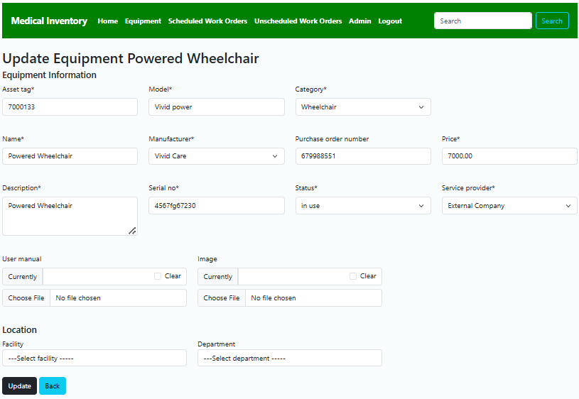

-  **F07 Scheduled Work Order**

      The Scheduled Work Order form allows the User to setup in advance when the equipment is due for service or calibration or validation. The User click on the **Add PM** button to add a scheduled action which is preventative maintenance,calibration, validation or inspection. The **Add PM** is on each equipment so when **Add PM** is clicked a pre-populate form for that equipment comes up and the User can add the type of Scheduled work order to be carried including the dates the service was last serviced and the next service.

      

-  **F08 Unscheduled Work Order**

      The Unscheduled Work Order is an unplanned repair. Equipment breakdown can other anytime despite carrying Scheduled services to minimise breakdowns. The User can add repairs to each equipment by clicking the **Add Repair** button.

      

-  **F09 Scheduled Work Order View**

      The User can view all Scheduled WorK Orders under their Facility or Hospital. The Admin can view all Equipment from all facilities.

      

-  **F10 Unscheduled Work Order View**

      The User can view all Unscheduled WorK Orders under their Facility or Hospital. The Admin can view all Equipment from all facilities.

      

-  **F11 Equipment Details View**

      The User can view each equipment details by clicking Equipment in the Navbar and then click on the name of that equipment highlighted in blue.

      Equipment Details Link using Equipment name

      

      Equipment Details After clicking Equipment name. You can view equipment general informatin, location,scheduled and unshceduled work orders.

      

-  **F12 Equipment Search**

      The User can enter an equipment id for example equipment tag. User enter one of their equipment tag 7000105. The search returns results.

      

      The User clicks on the results and the equipment details is shown on the window.

      

-  **F13 Equipment Export**

      The User can export Equipment List into a pdf file for sharing with other team members. Each facility can only share their equipment. The Admin can view all equipment from all facilities.

      

-  **F14 Django Admin**

      The Admin can add equipment, create equipment catagories, departments, health facilities, equipment location,equipment manufacturers, service providers,add users and give users permissions.

      

-  **F15 Relationship Diagrams For DBMS**

      The Relationship diagram for the DBMS consists of the following tables: Manufacturer, Category, Health Facility, Service Provider, Department, Equipment Location, Equipment and CustomUser

      

-  **F16 Sign Up**

      This platform required strict control over which users could access and add equipment, update equipment repairs, maintenance and event logs in the system. The user must register or sign in before access is granted to the site. The user register with a username, email, facility which the user has permission to access and password. The Site Admin will verify if the user has permission and allow permission to that facility only.

      User sign Up

      

      User waiting for Site Admin Verification

      

      Site Admin Verify User

      

      User Login to the site

      

      User View Equipment on the User Facility

      

      Site Admin can change equipment details or scheduled or unscheduled work order in the admin panel.

      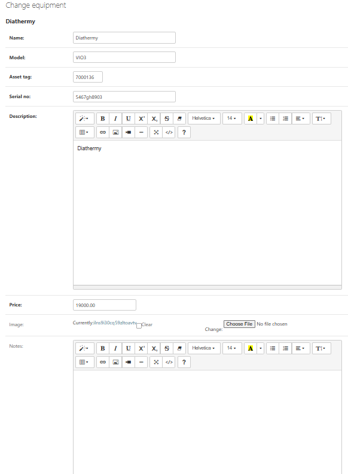

### Features which could be implemented in the future

-   __Contracts Application__
    
    The contracts application will be linked to the Scheduled work orders and unscheduled work orders so that renewing of contracts is co-ordinated.

-   __Work Orders Generation__

    A feature to generate scheduled work orders will be added so that the user by a click of a button will automatically know which equipment is due for a service next week / next month. This will help to free the equipment due for service.

-   __Equipment Overdue for Service__

    A feature to pop up showing equipment which is overdue for service and to allow the user to add a two week grace period as an extension of the service history.

-   __Graphical Represantation of Equipment Statistics__

    A graphical represantation is required by managers to quickly access equipment information, work carried inhouse, work carried by external companies. Work to be serviced next month, total repairs and cost. Equipment over international standard of 8 years which need to be replaced and the cost.

-   __More Permission for different groups__

    There are many groups of staff in facilities and hospitals with different equipment information interest. Due to time these groups were not fully covered in this project but will be covered in the future.

## Design

-   ### Wireframe

      The wireframe showing how to add equipment, update equipment, add preventative maintenace to equipment and add a repair job to the equipment is shown below.

      

      
Add Equipment Wireframes

      
      

      

      
Update Equipment Wireframes

      
      

      

      
Add PM Wireframes

      
      

      

      
Add Repair Wireframes

      
      

## Planning

### User Stories and Kanban board can be accessed here
    
   [User Story](https://github.com/users/RusJamison/projects/1)

## Technologies Used

### Languages Used

-   [HTML5](https://en.wikipedia.org/wiki/HTML5)
-   [CSS3](https://en.wikipedia.org/wiki/Cascading_Style_Sheets)
-   [Jquery](https://jquery.com/)
-   [Python](https://www.python.org/)

### Frameworks, Libraries & Programs Used

-   [Google Fonts:](https://fonts.google.com/) used for the Lato font
-   [Font Awesome:](https://fontawesome.com/) was used to add icons for aesthetic and UX purposes.
-   [Git:](https://git-scm.com/) Version control by utilising the Gitpod terminal to commit to Git and Push to 
           GitHub.
-   [GitHub:](https://github.com/) Respository for the project code after being pushed from Git. 
             GitHub was also used for User Stories (GitHub Issues) and tracking them on a Kanban board.
-   [dbdiagram.io](https://dbdiagram.io/home) Entity Relationship diagrams for the application data model
-   [Cloudinary](https://cloudinary.com/) image storage
-   [Summernote](https://pypi.org/project/django-summernote/) used for reports
-   [Django allauth](https://django-allauth.readthedocs.io/en/latest/index.html) used for account registration and authentication
-   [Django crispy forms](https://django-crispy-forms.readthedocs.io/en/latest/) used for forms
-   [coverage](https://coverage.readthedocs.io/en/coverage-5.5/) used to check how much of the python code has been covered by 
               automated tests
-   [Balsamiq:](https://balsamiq.com/) Create the wireframes during the design process.
-   [Django](https://www.djangoproject.com/) Framework to support rapid and secure development of the application
-   [Bootstrap](https://getbootstrap.com/) Used to build responsive web pages
-   [Gunicorn](https://gunicorn.org/) Assist Web Server to run Django on Heroku
-   [dj_database_url](https://pypi.org/project/dj-database-url/) library for database urls to connect to the Postgres db
-   [psycopg2](https://pypi.org/project/psycopg2/) database adapter used to support Postgres db

## Testing

### Validator Testing 

- [HTML Validator](https://validator.w3.org/)

    - As this project uses Django templates the html has been validated using url

    - Results for validate by URL with errors
      - 

        
Validation URL check - Summary

        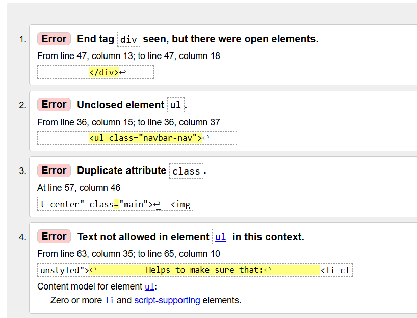
      

    
    - Results for validate by URL with errors cleared
      - 

        
Validation URL check without errors - Summary

        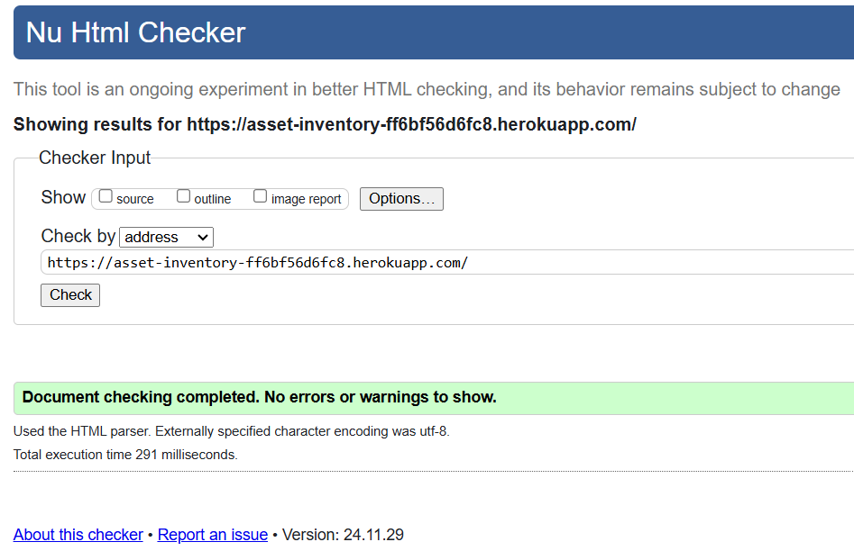
      

    - [Python Validator](https://pep8ci.herokuapp.com/)

  

    
project urls.py validation results

    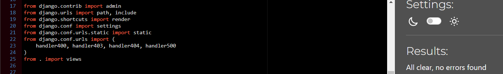
  

  

    
project views.py validation results

    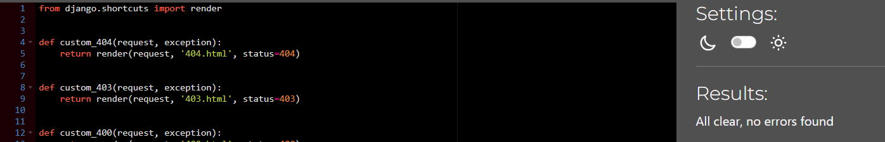
  

  

    
Equipment application urls.py validation results

    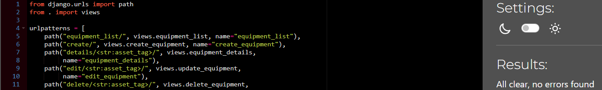
  

   

    
Equipment application models.py validation results

    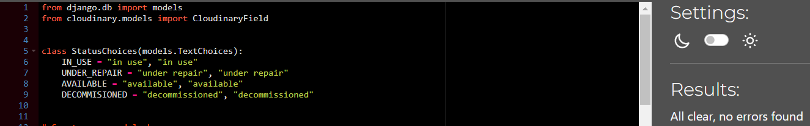
  

   

    
Equipment application forms.py validation results

    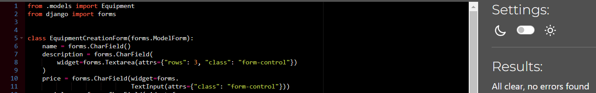
  

   

    
Equipment application app.py validation results

    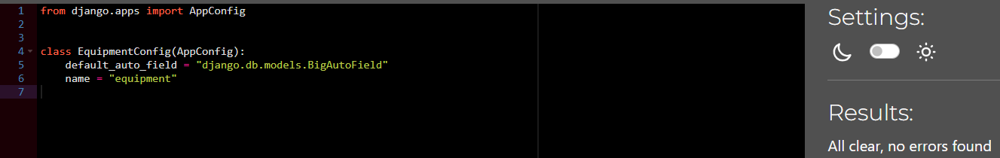
  

   

    
Equipment application admin.py validation results

    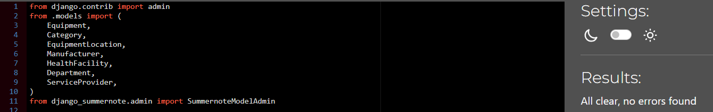
  

   

    
Equipment application utils.py validation results

    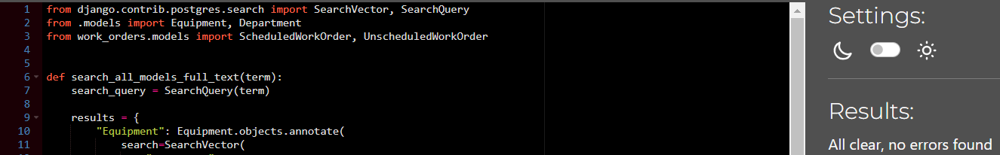
  

   

    
Equipment application views.py validation results

    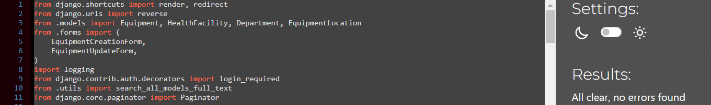
  

    

    
Equipment application test-create.py validation results

    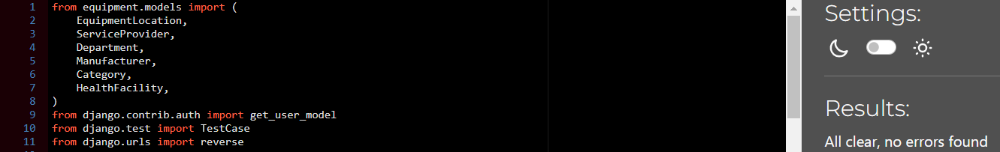
  

    

    
Equipment application test-delete.py validation results

    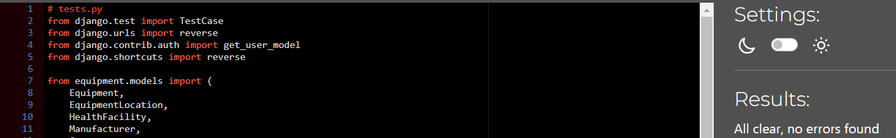
  

    

    
Equipment application test-details.py validation results

    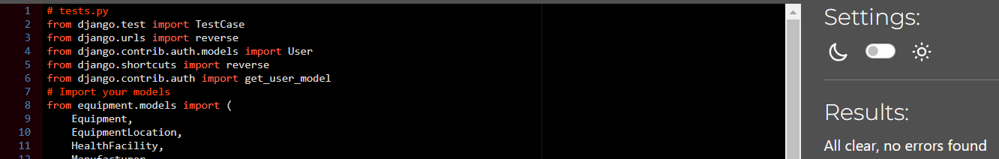
  

    

    
Equipment application test-update.py validation results

    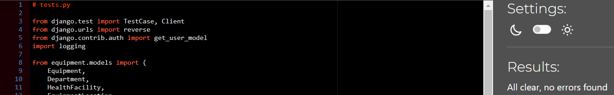
  

    

    
Equipment application test-equipment-list.py validation results

    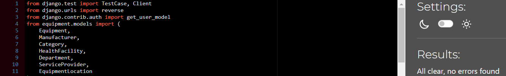
  

    

    
Work Order application admin.py validation results

    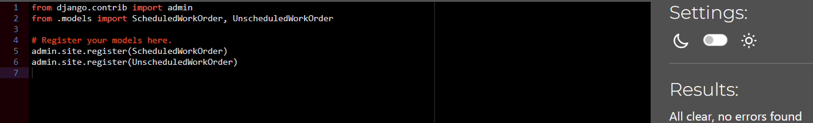
  

     

    
Work Order application app.py validation results

    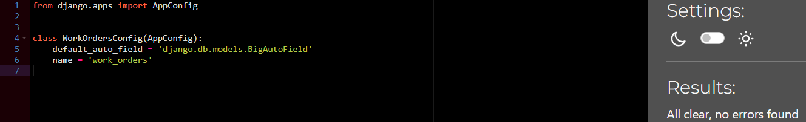
  

     

    
Work Order application models.py validation results

    
  

     

    
Work Order application urls.py validation results

    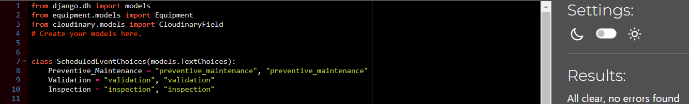
  

     

    
Work Order application views.py validation results

    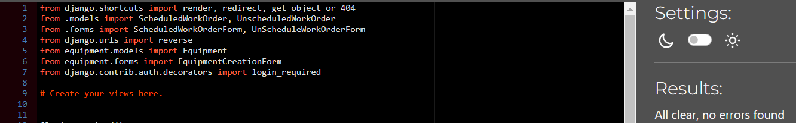
  

     

    
Work Order application forms.py validation results

    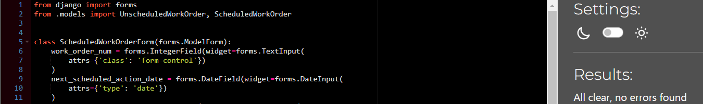
  

     

    
Scheduled Work Order application test-create.py validation results

    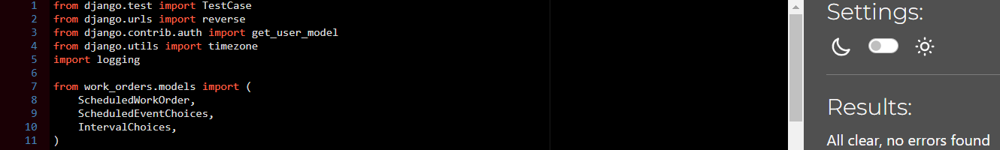
  

     

    
Scheduled Work Order application test-list.py validation results

    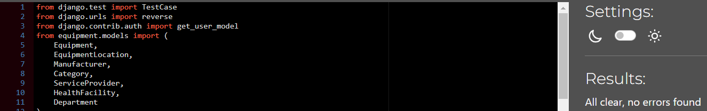
  

### Lighthouse Testing

  -   Lighthouse testing results

      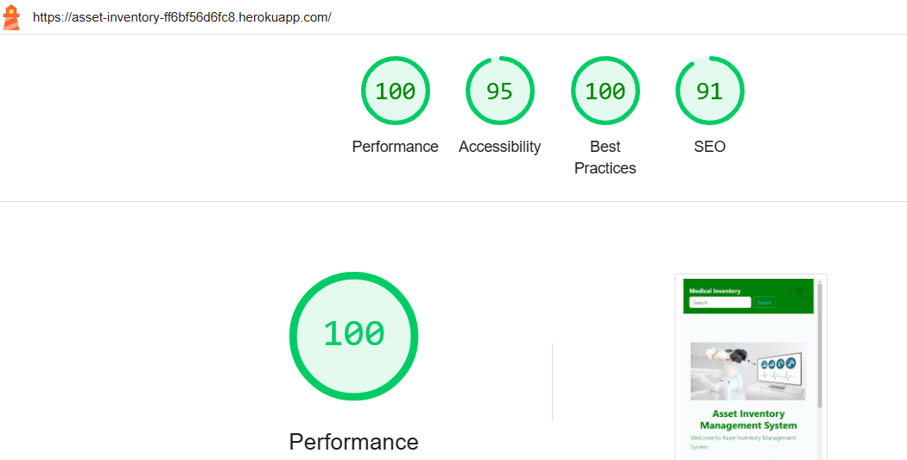

### Automated Testing

- 23 tests were tested for automated testing. Below are the coverage html report of the tests.
- Django test results and coverage :   
    

    
    

### Manual Testing and Results

| User Story                                          | Acceptance Criteria                                                                                                                                                                                                                                                                                                                                                                                                        | Steps                                                                                                                                                                                                                                                                                                                                                                                                                                                                                                                                                                             | Expected Outcome                                                                                                                                                                                                                                                                                                                                                                                                                             | Result |
| --------------------------------------------------- | -------------------------------------------------------------------------------------------------------------------------------------------------------------------------------------------------------------------------------------------------------------------------------------------------------------------------------------------------------------------------------------------------------------------------- | --------------------------------------------------------------------------------------------------------------------------------------------------------------------------------------------------------------------------------------------------------------------------------------------------------------------------------------------------------------------------------------------------------------------------------------------------------------------------------------------------------------------------------------------------------------------------------- | -------------------------------------------------------------------------------------------------------------------------------------------------------------------------------------------------------------------------------------------------------------------------------------------------------------------------------------------------------------------------------------------------------------------------------------------- | ------ |
| US01: Illustrate purpose of application through  UI | The landing page must clearly communicate the application's purpose. The landing page shows the summary advantages of the site. The landing page encourage the user to want to view more The "Sign Up," or "Login" must be visible.                                                                                                                                                                               | Check for Sign-up or Login Check the page summary Check for the main purpose Check for the layout                                                                                                                                                                                                                                                                                                                                                                                                                                                                                 | Sign Up and Login clearly labelled at the top and bottom The page summary clearly explains the purpose of the application The layout gives the user appetite to explore more                                                                                                                                                                                                                                                              | Pass   |
| US02: Navigate site                                 | Registration form require User to enter username, password and health facility User verification can take up to 24 hours Upon successful registration User can sign in with the username and password they created during registration                                                                                                                                                                               | Go to the landing page.  Make sure the user is not signed in. Navigate to Register and Sign in buttons Register without facility Register with facility Try to sign in again with the username and password you created .                                                                                                                                                                                                                                                                                                                                             | User will not sign in before registration User is asked to wait for Admin permission before accessing the application User cannot register without a facility User can now sign in to the application                                                                                                                                                                                                                                  | Pass   |
| US03: View equipment list                           | In equipment list the name of equipment link to the equipment details View details from general information to scheduled work order and unscheduled work orders View all equipment under my health facility                                                                                                                                                                                                          | Go to home page View the equipment list On each row click on the equipment name                                                                                                                                                                                                                                                                                                                                                                                                                                                                                             | User can view summary of equipment list When the equipment name is clicked the user is able to view the whole equipment information which includes the general equipment information, equipment location, scheduled work orders and unscheduled work orders for that particular equipment                                                                                                                                                 | Pass   |
| US04: View equipment information                    | Equipment tab allows you to view all equipment under your health facility Scheduled work order button allow user to see all planned work orders Unscheduled work order button allow user to see all unplanned work orders The detailed pages for equipment and work orders must be designed to be visually clear, with labels for each field.                                                                     | Go to home page Click on Equipment tab Click on Scheduled Work Order tab Click on Unscheduled Work Order tan                                                                                                                                                                                                                                                                                                                                                                                                                                                                | The Navbar clearly shows Equipment, Scheduled and Unscheduled work order tabs. By clicking the equipment tab the user see all equipment which belongs to their facility, for Admin it will be equipment for all facilities Clicking Scheduled work order the user sees all Scheduled work orders for their facility. By clicking Unscheduled work order tab, the user sees all repairs (unscheduled work orders) for their facility | Pass   |
| US05: Add new equipment                             | The form fields must be clear to the user when populating the equipment details. Any errors to be communicated to the user to be able to correct the error The date fields must be clear for all users to accommodate users from different continent                                                                                                                                                                 | Click on add equipment Enter equipment details.                                                                                                                                                                                                                                                                                                                                                                                                                                                                                                                                   | Fields are clearly labelled Day, date fields clearly labelled The required fields, if not completed the user is prompted to do so. Dropdown menu all have prepopulated options When user click save the added equipment is shown at the top of the equipment list                                                                                                                                                                   | Pass   |
|                                                     | Some fields have dropdown menu to confirm to international nomenclature                                                                                                                                                                                                                                                                                                                                                    |                                                                                                                                                                                                                                                                                                                                                                                                                                                                                                                                                                                   |                                                                                                                                                                                                                                                                                                                                                                                                                                              |        |
| US06: View equipment in Inventory                   | View equipment scheduled work order date to arrange services View equipment age from installation date to replace equipment View equipment and distribute to other locations To budget for new equipment using principle any equipment 8 years must be replaced                                                                                                                                                   | Go to the landing page. Registered User sign in On home page navbar \-click on equipment \-click on scheduled work orders \-click on unscheduled work orders                                                                                                                                                                                                                                                                                                                                                                                                             | Signed into the home page. View equipment department location and change if necessary Can view equipment age from equipment installed and first use date under equipment name link                                                                                                                                                                                                                                                     | Pass   |
| US07: Delete equipment                              | Confirmation (Are you sure you want to delete this equipment?") . If user confirms, equipment will be removed Deleted equipment must not appear anyway after the delete action Perform User testing of delete action                                                                                                                                                                                           | Go to the landing page Sign in if you are a registered user Click view equipment at the bottom of the home page Click add equipment at the top of screen Populate information in the add equipment form Click add The top row of the equipment list shows the newly added equipment Click delete icon on the newly added equipment                                                                                                                                                                                                                                 | When user login can only see equipment under the user health facility or hospital User can add equipment only to the user facility When the user clicks on Equipment on the navbar an Equipment list of all equipment under the user facility is displayed When the delete icon is clicked a warning is displayed “Are you sure you want to delete the equipment I.e. ventilator. This is irreversible Delete or Cancel”            | Pass   |
| US08: Search equipment                              | A search bar must be present on inventory page for users to search equipment by equipment asset tag If no matching equipment asset tag number is found returns no results found If a valid asset tag number is found, the user must be presented with the equipment details being searched                                                                                                                           | Go to the landing page Sign in if you are a registered user Click view equipment at the bottom of the home page Click Equipment in the navbar of the home page Choose any asset tag number Enter the asset tag number in the search field In real world the user checks the asset tag on the actual equipment and search it in the database                                                                                                                                                                                                                           | The entered equipment asset tag returns one of the two options When equipment is found it returns a link which in turn when clicked the detailed general equipment information is displayed Second option the search feature returns “No results found”                                                                                                                                                                                | Pass   |
| US09: Update equipment                              | Able to change equipment department within same facility for user Able to correct and information captured earlier The user must only be allowed to update equipment belonging to their facility The system must save the updated changes and redirect the user the equipment list.                                                                                                                               | Go to the landing page Sign in if you are a registered user Click view equipment at the bottom of the home page Click Equipment in the navbar of the home page Under the Equipment list display choose the equipment you want to update Click the edit icon on the item you want to change the details Correct an input field or enter new data Change department if required and click update                                                                                                                                                                  | Equipment update captured All field edited changed.                                                                                                                                                                                                                                                                                                                                                                                          | Pass   |
|                                                     |                                                                                                                                                                                                                                                                                                                                                                                                                            | Check to see if changes reflect on the equipment the user updated                                                                                                                                                                                                                                                                                                                                                                                                                                                                                                                 |                                                                                                                                                                                                                                                                                                                                                                                                                                              |        |
| US10: Create scheduled work order                   | Users must only be able to create events for equipment assigned to their facility. The equipment history of last service date and next service date must be easily available all the time It must not be possible to delete equipment service history without deleting the whole equipment details.                                                                                                                  | Go to the landing page Sign in if you are a registered user Click view equipment at the bottom of the home page Click Equipment in the navbar of the home page Under the Equipment list display choose the equipment you want to add a scheduled work order Click the add PM button on the item you want to add a scheduled work order Fill in the form which is displayed after clicking Add PM Save the form Click on Scheduled work order button on the navbar to view the newly created scheduled work order                                                | In scheduled work order list, the newly created work order can be viewed In Equipment list the user can only view equipment related to the user facility so there is no option to add work orders on equipment outside  the user facility                                                                                                                                                                                                    | Pass   |
| US11: Create unscheduled work order                 | Users must see an option (e.g., a button or link) to create a new repair (unscheduled work order) on the equipment detail page or inventory page. The system must provide a unique identifier for each work order (e.g., Work Order Number). Allow for further repairs in the update section, work order to be closed at end of repair                                                                               | Go to the landing page Sign in if you are a registered user Click view equipment at the bottom of the home page Click Equipment in the navbar of the home page Under the Equipment list display choose the equipment you want to add an unscheduled work order Click the Add Repair button on the item you want to add an unscheduled work order Fill in the form which is displayed after clicking Add Repair Save the form Click on Unscheduled work order button on the navbar to view the newly created unscheduled work order                           | In unscheduled work order list, the newly created work order can be viewed In Equipment list the user can only view equipment related to the user facility so there is no option to add work orders on equipment outside the user facility                                                                                                                                                                                                | Pass   |
| US12: Equipment status                              | Users must see an option (e.g., a dropdown or button) to update the status of equipment on the equipment detail page. Users must only be able to update the status of equipment belonging to their facility. The system must provide the following status options: In Use Under Repair Decommissioned                                                                                                          | Go to the landing page Sign in if you are a registered user Click view equipment at the bottom of the home page Click Equipment in the navbar of the home page Under the Equipment list display choose the equipment you want to update Click the edit icon on the item you want to change the details Correct an input field or enter new data Change department if required and click update Update the equipment status in the dropdown menu namely in use, Under Repair or Decommissioned Check to see if changes reflect on the equipment the user updated | The user can view the status of each item namely in use or under repair or decommissioned                                                                                                                                                                                                                                                                                                                                                    |        |
| US13: Account registration and login                | "Register" button or link must be visible on the landing page and/or navigation bar. The registration form must collect the following information: Name (required) Email Address (required) Password (required) Facility Information (required) Upon successful registration through admin permission the user can login                                                                                    | Go to the landing page. Make sure the user is not signed in. Navigate to Register and Sign in buttons Register without facility Register with facility Try to sign in again with the username and password you created .                                                                                                                                                                                                                                                                                                                                              | User will not sign in before registration User is asked to wait for Admin permission before accessing the application User cannot register without a facility User can now sign in to the application                                                                                                                                                                                                                                  | Pass   |
| US14: Manage                                        | Checking user permissions                                                                                                                                                                                                                                                                                                                                                                                                  | Go to the landing page Sign in if you are registered as the Site Admin Click Admin tab Check for the users awaiting verification so that they can log on to the asset inventory management system.                                                                                                                                                                                                                                                                                                                                                                          | Site Admin accepts or deny user                                                                                                                                                                                                                                                                                                                                                                                                              | Pass   |
|                                                     |                                                                                                                                                                                                                                                                                                                                                                                                                            |                                                                                                                                                                                                                                                                                                                                                                                                                                                                                                                                                                                   |                                                                                                                                                                                                                                                                                                                                                                                                                                              |        |
| US15: Manage Facilities and Departments             | Site Admins must be able to add new facilities via a form that includes: Facility Name (required). Location (required). Description (optional). Site Admins must be able to add new departments to a facility via a form that includes: Department Name (required). Facility (required, pre-filled if accessed through a facility view). Deleting a facility must also delete its associated departments | Go to the landing page Sign in if you are registered as the Site Admin Click Admin tab Click add facility Click add department Each department is linked to a facility                                                                                                                                                                                                                                                                                                                                                                                                | When the user register on the landing page, the user can see the facility they want to add, update, read and delete data The user can add the departments associated to the user facility as set by the site Admin in the Admin panel                                                                                                                                                                                                     | Pass   |
| US16: Approve Users                                 | The Site Admin must be able to approve or disapprove a user directly from the Django Admin interface. The list of approved users must display: Full Name Email Address Role Facility/Department Access Permissions Management Approved users must only be able to access the facilities and departments assigned to them with the permissions granted                                                          | Go to the landing page Sign in if you are registered as the Site Admin Click Admin tab Check for the users awaiting verification so that they can log on to the asset inventory management system. Compare their details to what you got from their line managers – approve or deny access                                                                                                                                                                                                                                                                               | User verification can take up to 24 hours Upon successful registration User can sign in with the username and password they created during registration                                                                                                                                                                                                                                                                                   | Pass   |
|                                                     |                                                                                                                                                                                                                                                                                                                                                                                                                            |                                                                                                                                                                                                                                                                                                                                                                                                                                                                                                                                                                                   |                                                                                                                                                                                                                                                                                                                                                                                                                                              |        |
| US17: Assign Manufacturers and Categories           | international nomenclature for equipment List of manufacturers                                                                                                                                                                                                                                                                                                                                                             | Go to the landing page Sign in if you are registered as the Site Admin Click Admin tab Add categories Add manufacturers Add facilities and department Add service providers                                                                                                                                                                                                                                                                                                                                                                                           | The fields are prepopulated with field options. This allows different facilities to adopt same naming The user can see their facilities and departments The user can see categories and service providers The site Admin manage to add categories, manufacturers, facilities, departments and service providers                                                                                                                        | Pass   |

## Deployment

Steps below show how to clone this project repository, configure and deploy the application to Heroku.

### How to Clone the Repository 

- Go to the https://github.com/RusJamison/asset_inventory repository on Github
- Click the "Code" button and copy the https link
- On the terminal navigate to directory where you want to place the clone

### Create Application and Postgres DB on Heroku

- Log in to Heroku at https://heroku.com
- Click the Create new app button on the Heroku dashboard
- On the Create New App page, enter a unique name for the application and select region.
- Then click Create app, and then click on the Resources tab.
- In the Add-ons search bar enter "Postgres" and select "Heroku Postgres" from the list 
- Then click the "Submit Order Form" button
- Click on Settings on the Application Configuration page and click on the "Reveal Config Vars" button
- Check the DATABASE_URL has been automatically set up
- Add a new Config Var called SECRET_KEY and assign it a value
  - DATABASES = {'default': dj_database_url.parse(os.environ.get('DATABASE_URL'))}

  - SECRET_KEY = os.environ.get('SECRET_KEY')

- Make migration and migrate in Gitpod
- Commit and push any local changes to GitHub.
- Make sure the project requirements.txt file is up to date with all necessary supporting files

### Configure Cloudinary to host images used by the application

- Click the provided link to sign up for Cloudinary.
- Provide name and email address and choose a password
- In the Cloudinary dashboard, copy the CLOUDINARY_URL.
- Open the env.py file and set the value of the CLOUDINARY_URL
-  Open the Core/models.py and import the CloudinaryField from the cloudinary/models.py file
- In Heroku click on Settings and click on the "Reveal Config Vars" button.
- Add a new Config Var called CLOUDINARY_URL and assign it the value copied from the Cloudinary dashboard

### Connect the Heroku app to the GitHub repository

- On Heroku dashboard click on the Deploy tab. 
- Select GitHub as the Deployment Method 
- Enter the name of the github repository you want to deploy
- Choose manual deploy
- The live link for this project is - https://asset-inventory-ff6bf56d6fc8.herokuapp.com/

- Set DEBUG to False. Git add, commit and push the code to GitHub.
- Ensure requirements.txt is up to date using the command : pip3 freeze --local > requirements.txt
- In the Heroku Config Vars for the application delete this environment variable :  DISABLE_COLLECTSTATIC
- Click on deploy to manual branch

#### The live link to the application can be found here - [Asset Inventory Equipment Management System](https://asset-inventory-ff6bf56d6fc8.herokuapp.com/) 

## Credits

    The Code Institute Learning Platform, Learning Management System (LMS) was the main basis of my codes for this project. A number of my codes is based from the I Think Therefore I blog.

    Thanks to Amy Richardson for the resources she gave us during the course of this project. Thanks to Lewis who took over from Amy midterm of this project. Thanks for the resources Lewis shared with us.

    Thanks to my mentor Brian Macharia for his mentoring sessions, guidance, patience, encouragement and constant motivation throughout the project.

    Thanks to the tutors whom I get help and support during the project. Special mentioning Alan and Rebecca, Sarah for their knowledge sharing skills, patience and quick response.

### Content
-  Special thanks to the following learning platforms I used their resources
   - Udemy
   - Linkedin Learning
   - Coursera

    Object Oriented Programming in Python by Estefania Cassingena Navone (https://www.udemy.com/course/python-object-oriented-programming-oop/learn/lecture/12356228?start=150#overview)

    Python Masterclass 2024: Build 24 Real World Python Projects by Ashutosh Pawar (https://www.udemy.com/course/python-masterclass-course/learn/lecture/37365778?start=105#overview)

    100 Days of Code: The Complete Python Pro Bootcamp
    by Dr. Angela Yu (https://www.udemy.com/course/100-days-of-code/learn/lecture/20628484?start=60#overview)

    Python 3: Deep Dive (Part 3 - Dictionaries, Sets, JSON)
    by Dr. Fred Baptiste (https://www.udemy.com/course/python-3-deep-dive-part-3/learn/lecture/12049204?start=615#overview)

    Python Mega Course: Learn Python in 60 Days, Build 20 Apps by Ardit Sulce
    (https://www.udemy.com/course/the-python-mega-course/learn/lecture/34597268?start=240#overview)

    README by Elaine Broche(https://github.com/elainebroche-dev/pf4-wayfarers-guided-hikes)

    Tools for Writing, Sizing, and Validating User Stories including Well-Defined Acceptance Criteria and Gherkin Scenarios
    by Tom and Angela Hathaway (https://www.udemy.com/course/writing-effective-user-stories/learn/lecture/)

    Generate Dynamically PDF files using Python and ReportLab
    by Hugo Ferro (https://www.udemy.com/course/python-reportlab-from-beginner-to-winner/learn)

    Master Python Django 5.0: Learn Django (Core + Advanced Concepts), Behind-the-Scenes, Projects, Boost Career With AI
    by Taranjot Singh (https://www.udemy.com/course/django-complete-course/learn)

    Every Python Programmer Must Have This Skill!!
    by Coding Gears | Train Your Brain (https://www.udemy.com/course/python-unit-testing-fundamentals/learn)

    Take the next step in your Python development by leveraging the power of PostgreSQL and databases!
    by Jose Salvatierra (https://www.udemy.com/course/complete-python-postgresql-database-course/learn)

    Learn the entire technology stack to create beautiful and responsive websites with Python and Django!
    by Jose Portilla (https://www.udemy.com/course/django-and-python-full-stack-developer-masterclass/learn)

    Build 3 stunning websites, learn Back and Front End Web Development, deploy your site with HTML5, CSS3 and Bootstrap 4
    by Nick Walter (https://www.udemy.com/course/django-3-make-websites-with-python-tutorial-beginner-learn-bootstrap/learn/)

    Django Masterclass : Build 9 Real World Django Projects
    by Ashutosh Pawar (https://www.udemy.com/course/django-course/learn/)

    Master Django and Create Python Web Applications in Simple Steps
    by Bharath Thippireddy (https://www.udemy.com/course/django-for-python-developers/learn)

    Learn SQL From Scratch Using MySQL Databases, A Complete SQL Course For Beginners
    by Ashutosh Pawar (https://www.udemy.com/course/sqlcourse/learn/) 

    Master Bootstrap 4 and build 5 real world themes while learning HTML5 semantics & CSS3
    by Brad Traversy (https://www.udemy.com/course/bootstrap-4-from-scratch-with-5-projects/learn)

    Learn Python and build & deploy a real estate application using the Django framework & PostgreSQL
    by Brad Traversy (https://www.udemy.com/course/python-django-dev-to-deployment/learn/)

    Learn the basics of Balsamiq Wireframes, an invaluable tool for creating rapid user interface wireframes.
    by Leon Barnard (https://www.udemy.com/course/getting-started-with-balsamiq-wireframes/learn)

    Unit Testing in Django by Leticia Portella (https://www.linkedin.com/learning/unit-testing-in-django)

    Advanced Django Project: Build High-Traffic Websites with Django by Ryan Mitchell (https://www.linkedin.com/learning/advanced-django-project-build-high-traffic-websites-with-django)

    Django Essential Training by Leticia Portella (https://www.linkedin.com/learning/django-essential-training) 

    Full Stack Web Development with Flask by Christian Hur (https://www.linkedin.com/learning/full-stack-web-development-with-flask)

    Learning Django by  Caleb Smith (https://www.linkedin.com/learning/learning-django-2)

    Start the UX Design Process: Empathize, Define, and Ideate by Google (https://www.coursera.org/learn/start-ux-design-process)

    Django Web Framework by Meta (https://www.coursera.org/learn/django-web-framework/)

    Back-End Developer Capstone by Meta (https://www.coursera.org/learn/back-end-developer-capstone)

    Building Web Applications in Django by University of Michigan (https://www.coursera.org/learn/django-build-web-apps)

    Python Functions, Files, and Dictionaries by University of Michigan (https://www.coursera.org/learn/python-functions-files-dictionaries)

    The Power of Object-Oriented Programming by University of Michigan (https://www.coursera.org/learn/the-power-of-object-oriented-programming) 

    (https://www.pexels.com/) 

 

      

    
     
